# 함지애 | Backend Developer Portfolio

> 새로운 기술을 즐기며 꾸준히 성장하는 백엔드 개발자

📄 **[포트폴리오 PDF 다운로드](./Portfolio_HamJiae_2026-09.pdf)** · 📧 coup31307@gmail.com

신뢰할 수 있는 서비스를 만드는 백엔드 개발자를 목표로 합니다.
STT-LLM-TTS 실시간 파이프라인, 외부 API 연동, RAG 기반 AI 서비스까지 **AI를 실제 서비스로 연결하는 백엔드 설계**에 강점이 있습니다.

## Projects

| # | 프로젝트 | 기간 · 인원 | 유형 | 링크 |
|---|---|---|---|---|
| 01 | AI 콜센터 음성 상담 자동화 프로그램 및 기업 내부 전용 플랫폼 | 2025.12 ~ 2026.02 · 3인 | (주)IT-OS 기업 외주 | [Demo](https://gigapang.com/chat) |
| 02 | AI 기반 부동산 직거래 보조 플랫폼 | 2024.06 ~ 2025.06 · 3인 | 졸업작품 | [GitHub](https://github.com/Jiae-Ham/AIRealty-Rag-Peoject) · [KCI 논문](https://www.kci.go.kr/kciportal/ci/sereArticleSearch/ciSereArtiView.kci?sereArticleSearchBean.artiId=ART003293172) |
| 03 | AIDE - 교사 행정업무 지원 시스템 | 2026.06 ~ 2026.08 · 7인 | KT AIVLE School 9기 빅프로젝트 | [GitHub](https://github.com/KT-06-15/ai-teacher-be) |

## Tech Stack

- **Language & Framework** — Java, Spring Boot, JPA, Python, FastAPI, C++, JWT & OAuth2
- **Data** — PostgreSQL, MySQL, Redis, Kafka
- **AI** — RAG, LangChain, Prompt Engineering
- **Tool** — GitHub, Docker, Jira, Swagger, IntelliJ IDEA, Claude Code, MCP & Skills

---

## Portfolio

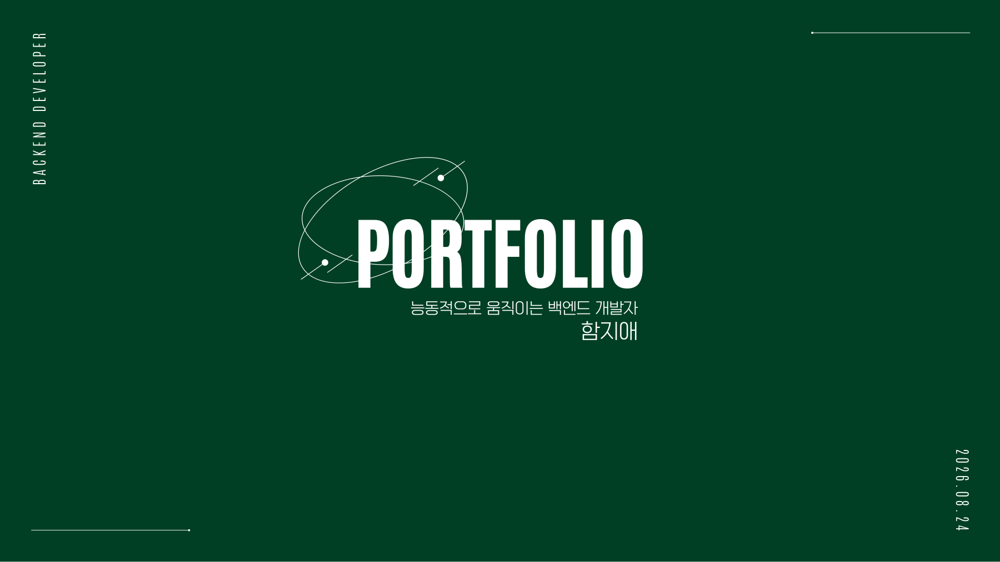

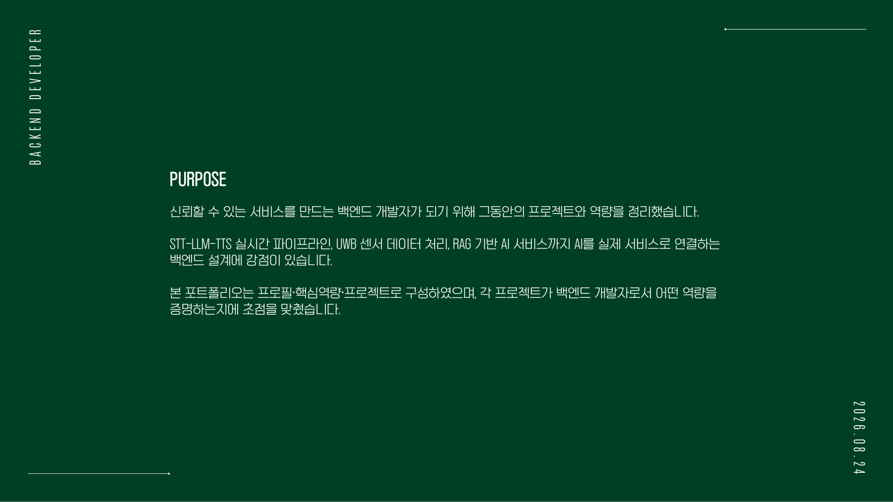

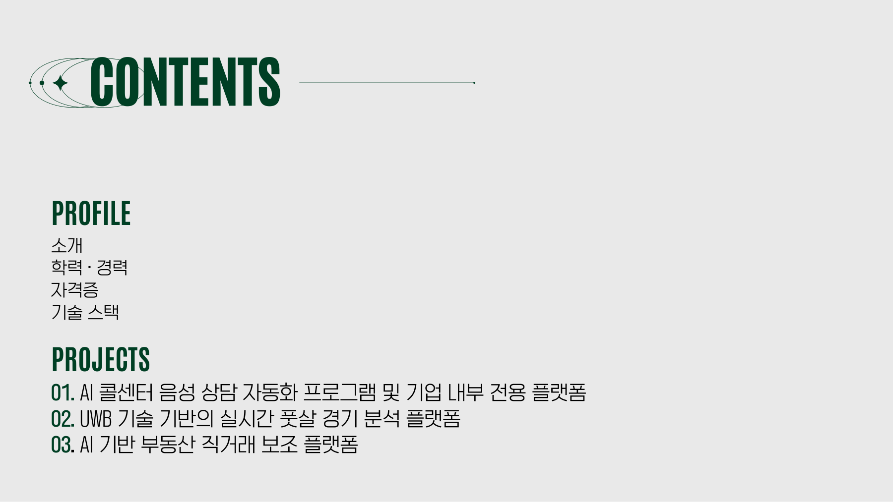

### Profile

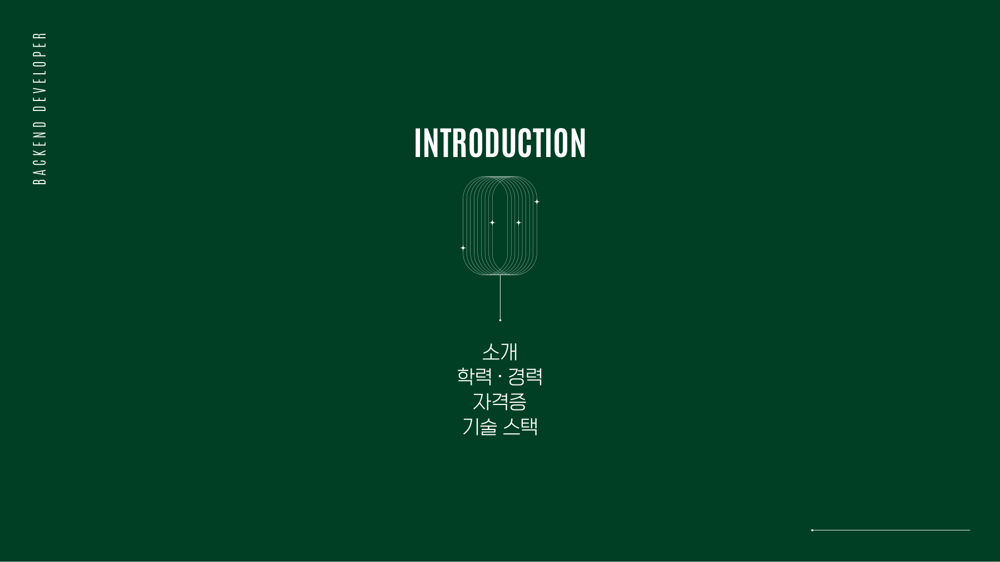

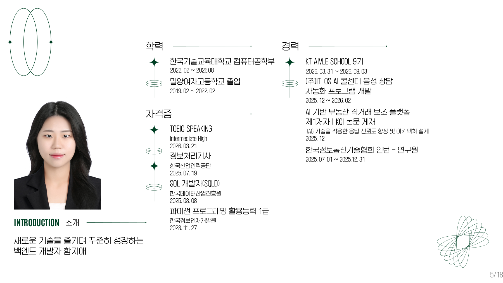

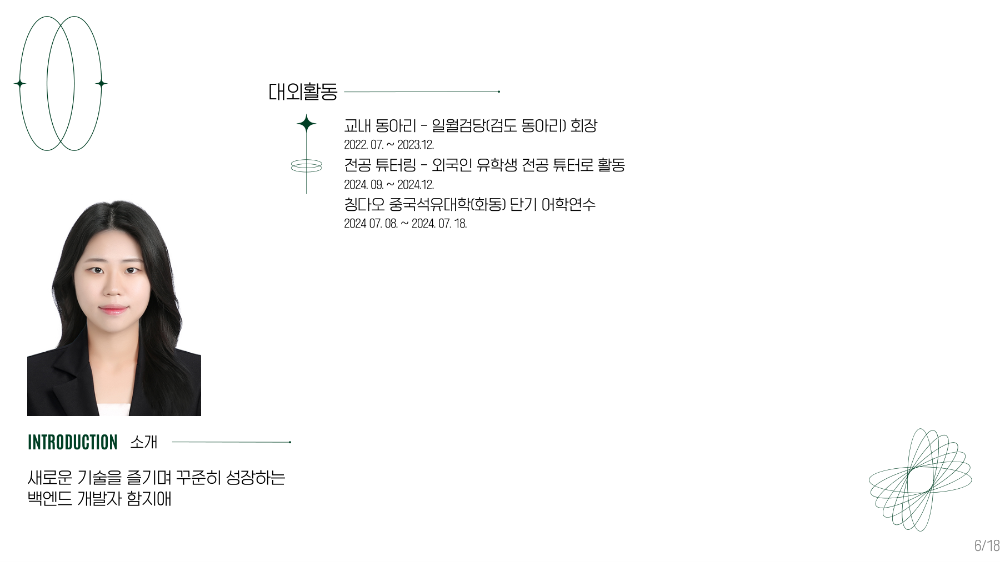

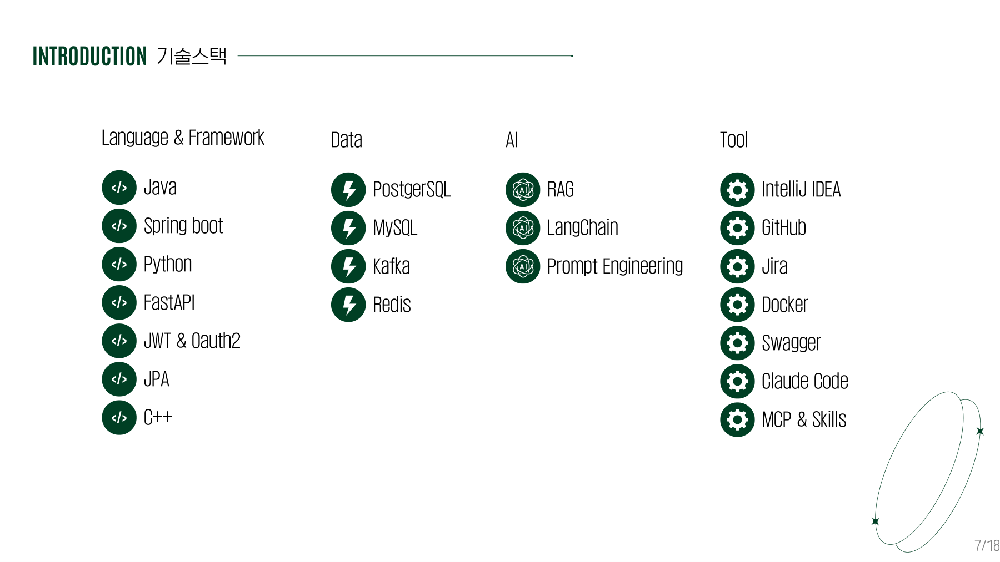

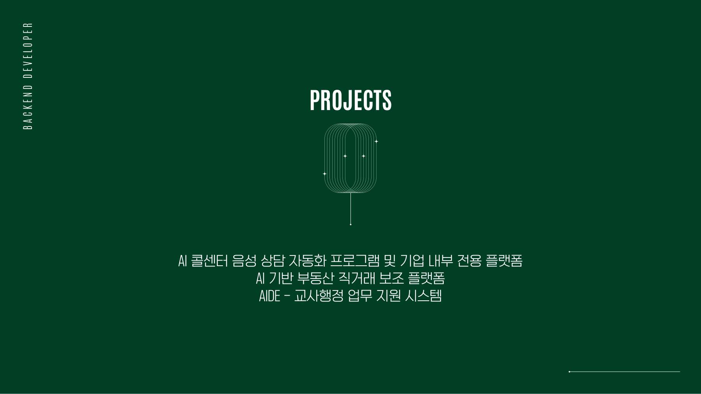

### Project 01. AI 콜센터 음성 상담 자동화 프로그램 및 기업 내부 전용 플랫폼

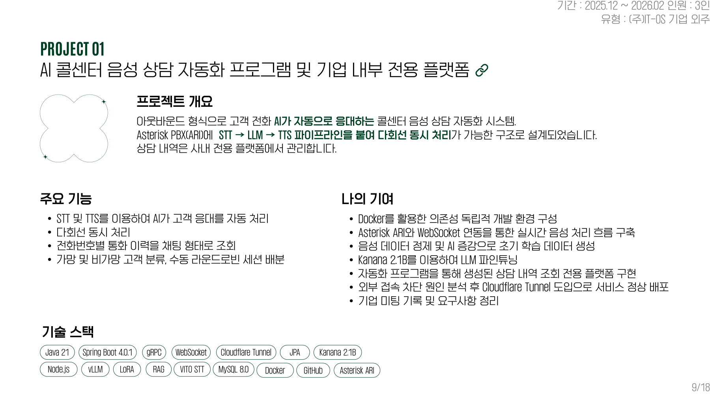

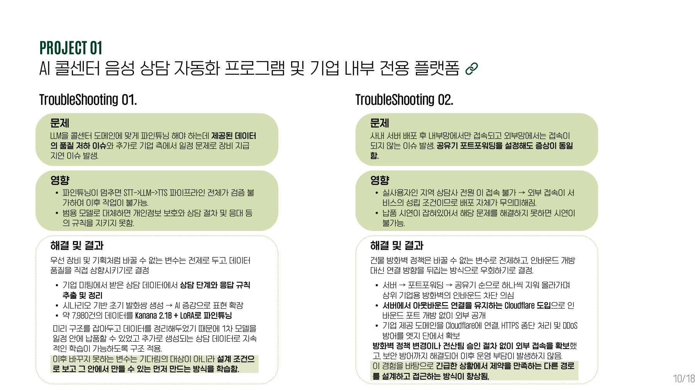

### Project 02. AI 기반 부동산 직거래 보조 플랫폼

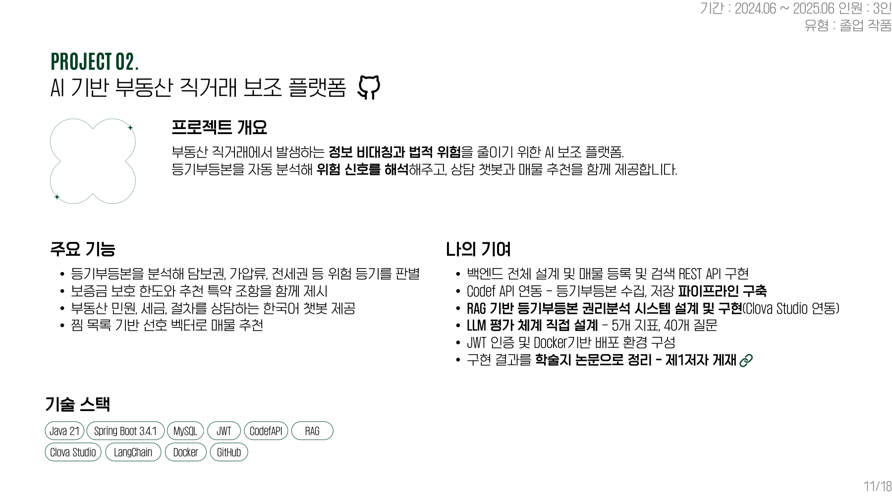

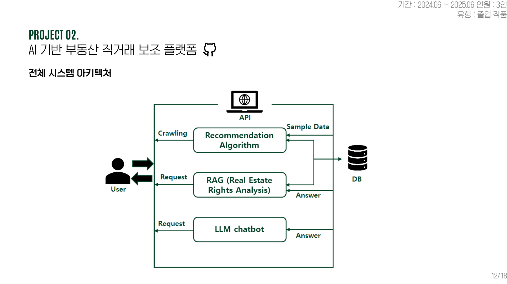

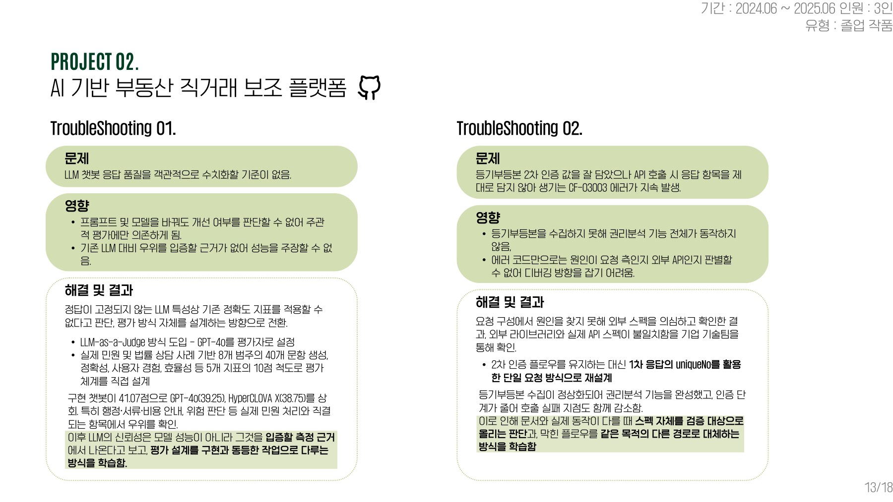

### Project 03. AIDE - 교사 행정업무 지원 시스템

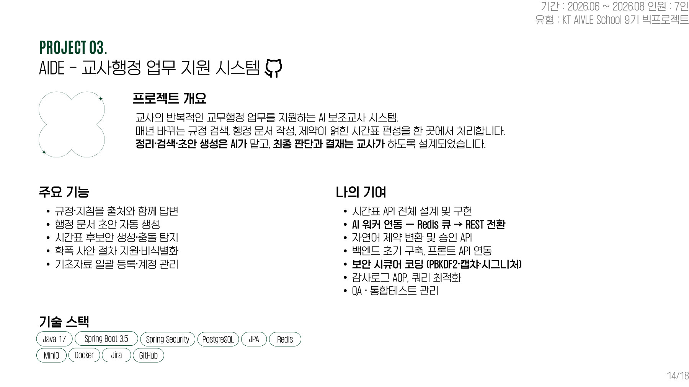

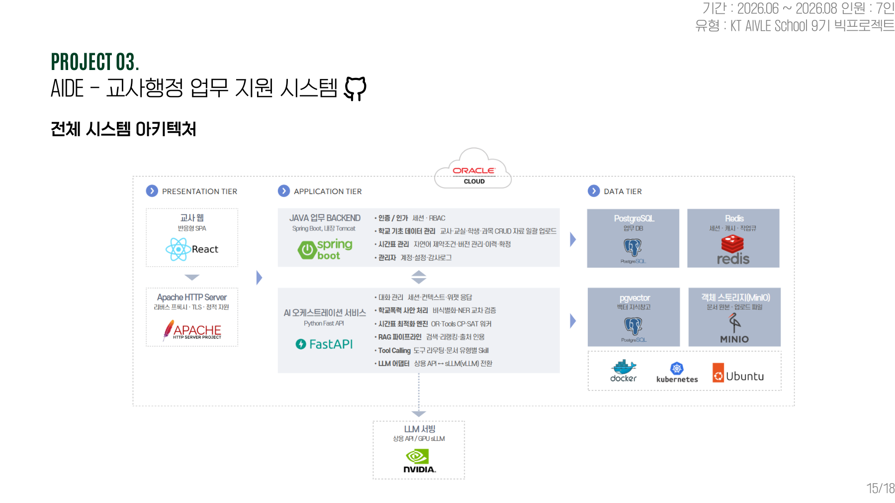

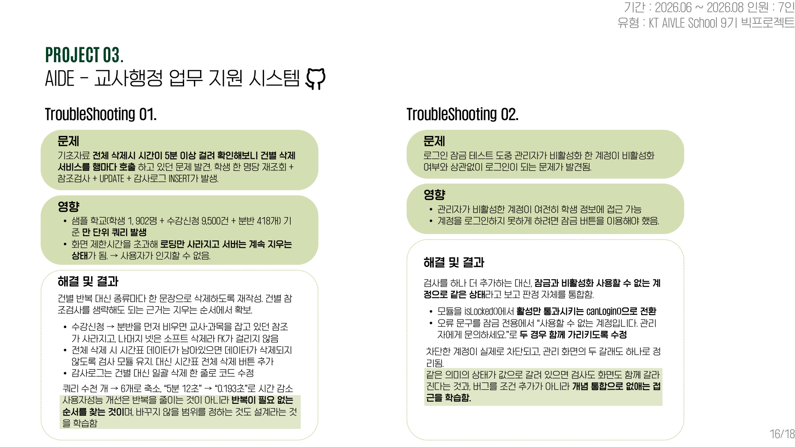

### 마무리

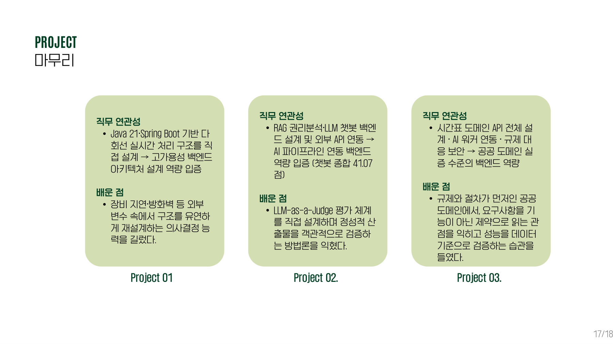

